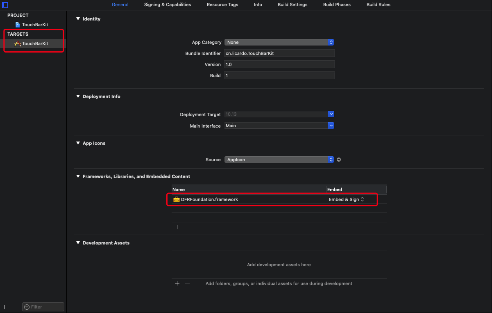

# TouchBarKit

> Display anything you want on Touch Bar right side of brightness button

This is a Swift version of [touch-baer](https://github.com/a2/touch-baer)

This uses a private API to display what you want on Touch Bar as a button, it is totally safe!

## Screenshots


## Get Started

1. Download or git clone my repo

2. Copy the `TouchBar.h` file to your project
   
   If you are on Swift, you should also create a bridging file

3. Embed `DFRFoundation.framework` to your target in the Xcode. `DFRFoundation.framework` can be found in `/System/Library/PrivateFrameworks/DFRFoundation.framework` of your Mac
   
   

## Usage

```swift
var touchBarButton: NSButton?

DFRSystemModalShowsCloseBoxWhenFrontMost(true)
let touchBarIdentifier = NSTouchBarItem.Identifier(rawValue: "TouchBar")
let touchBarItem = NSCustomTouchBarItem.init(identifier: touchBarIdentifier)
touchBarButton = NSButton(title: "Hello World!", target: nil, action: nil)
touchBarItem.view = touchBarButton!
NSTouchBarItem.addSystemTrayItem(touchBarItem)
DFRElementSetControlStripPresenceForIdentifier(touchBarIdentifier, true)
```

## Explanation

1. Show close button or not
   
   ```swift
   DFRSystemModalShowsCloseBoxWhenFrontMost(true)
   ```
   
   A close button can be like this:
   
   

## Related

- [ClockBar](https://github.com/L1cardo/ClockBar) - Clock, right on the Touch Bar

- [DarkLight](https://github.com/L1cardo/DarkLight) - Switch between Dark and Light mode with an ease

## Thanks

Big thanks to [Alexsander Akers](https://github.com/a2) and his project [touch-baer](https://github.com/a2/touch-baer)
